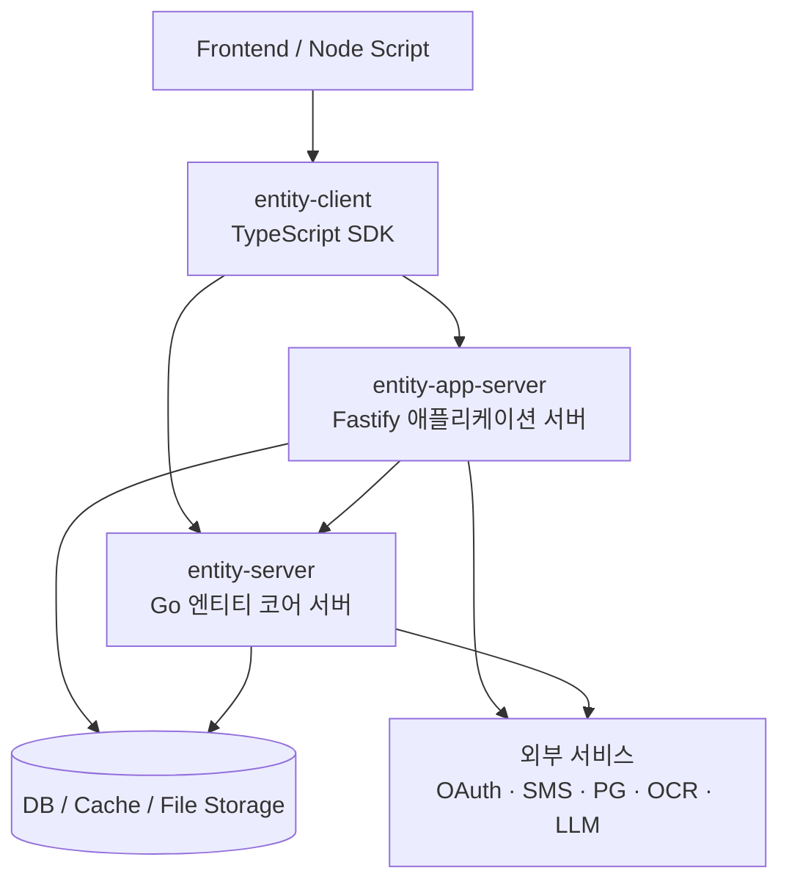
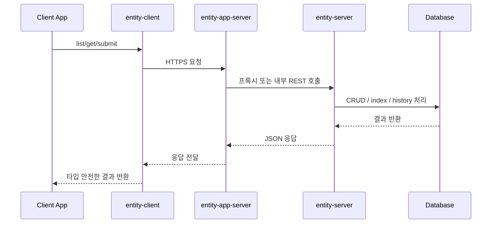
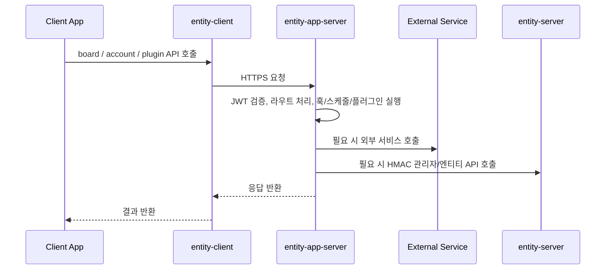
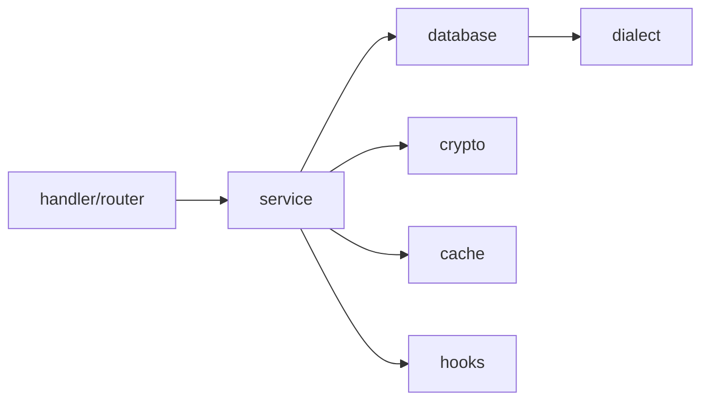
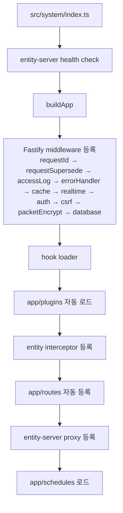
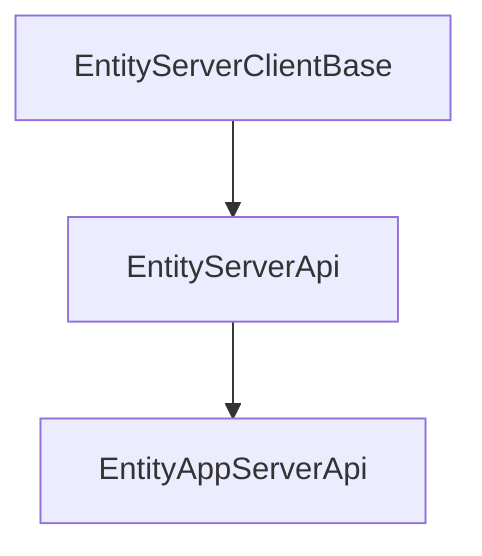

# 아키텍처

`entity-server`, `entity-app-server`, `entity-client`는 하나의 제품군처럼 동작합니다.
이 문서는 세 저장소의 관계, 각 저장소의 책임, 내부 구조, 사용 기술, 실제 요청 흐름을 한 번에 정리합니다.

---

## 한눈에 보기



| 저장소 | 주 역할 | 핵심 책임 |
| --- | --- | --- |
| `entity-server` | 데이터 코어 서버 | 엔티티 CRUD, 인증, 파일, 관리자 API, 엔티티 스키마 동기화 |
| `entity-app-server` | 앱 계층 서버 | 비즈니스 라우트, 플러그인, 스케줄러, 훅, Entity Server 프록시 |
| `entity-client` | TypeScript SDK | 두 서버의 API 래핑, 인증 헤더/HMAC/패킷 암호화/CSRF/세션 유지 자동화 |

요약하면 `entity-server`가 범용 데이터 플랫폼이고, `entity-app-server`가 실제 서비스용 앱 계층이며, `entity-client`가 두 서버를 프론트엔드와 Node 환경에서 일관되게 쓰게 해주는 SDK입니다.

---

## 저장소 관계

### 1. `entity-server`는 공통 백엔드 코어다

- JSON 엔티티 설정만으로 CRUD API를 생성합니다.
- 인증, 권한, 파일 업로드, 이력 관리, 인덱스 관리, 암호화를 담당합니다.
- `entity-app-server`는 이 서버를 전제로 동작합니다.
- `entity-client`의 `EntityServerApi`는 이 서버의 라우트를 직접 호출합니다.

### 2. `entity-app-server`는 서비스별 커스터마이징 계층이다

- `entity-server` 위에 얹는 Fastify 기반 애플리케이션 서버입니다.
- 커스텀 라우트, 플러그인, 스케줄러, 엔티티 훅을 TypeScript로 추가합니다.
- 일부 요청은 그대로 `entity-server`로 프록시하고, 일부는 자체 비즈니스 로직으로 처리합니다.
- 필요하면 DB에 직접 접근해 집계나 일반 테이블 조회를 수행합니다.

### 3. `entity-client`는 두 서버를 하나처럼 감싸는 SDK다

- `EntityServerApi`는 `entity-server` 전용 API 집합입니다.
- `EntityAppServerApi`는 `EntityServerApi`를 상속하고, 앱 전용 라우트와 플러그인 API를 추가합니다.
- 브라우저와 Node 코드에서 인증, HMAC, 패킷 암호화, CSRF, 세션 갱신, 실시간 연결을 공통 방식으로 다룹니다.

---

## 전체 요청 흐름

### 표준 엔티티 요청



### 앱 전용 비즈니스 요청



### 운영상 핵심 포인트

- 프론트엔드는 보통 `entity-app-server`만 바라봅니다.
- `entity-app-server`는 시작 시 `entity-server` 헬스체크에 실패하면 종료합니다.
- `entity-app-server`는 플러그인 엔티티를 `entity-server` 관리자 API로 등록하거나 동기화합니다.
- `entity-client`는 같은 코드 스타일로 직접 `entity-server`를 호출할 수도 있고 `entity-app-server`를 호출할 수도 있습니다.

---

## 저장소별 구조

## `entity-server`

### 역할

`entity-server`는 설정 중심 동적 엔티티 플랫폼입니다. 엔티티 정의 파일을 읽어 API, 테이블, 인덱스, 이력 구조를 자동으로 맞추고, 보안과 저장소 처리를 일관되게 제공합니다.

### 핵심 구조

| 경로 | 역할 |
| --- | --- |
| `cmd/` | 서버와 CLI 실행 진입점 |
| `internal/router/` | 인증, 엔티티, 파일, SMTP, 관리자 라우트 등록 |
| `internal/service/` | CRUD, 인덱스, 히스토리, 스키마 동기화, 훅 실행 |
| `internal/database/` | DB 커넥션 풀과 SQL Dialect 추상화 |
| `internal/config/` | JSON 설정 로더와 엔티티 검증 |
| `internal/crypto/` | 패킷 및 데이터 암복호화 |
| `internal/cache/` | Memory, File, Redis, Memcache, SQLite 캐시 추상화 |
| `internal/security/` | HMAC, JWT, RBAC, Nonce, Rate limit |
| `internal/storage/` | 로컬, S3, GCS, Azure, SFTP 등 파일 저장소 |
| `entities/` | 엔티티 스키마 정의 |
| `configs/` | database, security, server, cache 등 운영 설정 |

### 내부 아키텍처



### 데이터 모델 특징

엔티티 하나당 보통 세 계층이 분리됩니다.

| 테이블 | 역할 |
| --- | --- |
| `entity_data_*` | 암호화된 원문 데이터 저장 |
| `entity_idx_*` | 검색, 정렬, JOIN용 인덱스 컬럼 저장 |
| `entity_history_*` | 변경 이력 스냅샷 저장 |

이 구조는 보안과 조회 성능을 동시에 확보하려는 설계입니다. 원문은 암호화된 blob으로 두고, 검색이 필요한 필드만 인덱스 테이블에 분리합니다.

### `entity-server`가 잘하는 일

- 범용 CRUD API 자동 제공
- 엔티티 스키마 변경과 운영 명령의 CLI 및 관리자 API 일원화
- 다양한 DB와 Datastore 지원
- 파일 저장소와 보안 기능의 코어 통합

### `entity-server`가 직접 다루지 않는 일

- 서비스별 복합 도메인 로직
- 외부 SaaS별 라우트 조합
- 화면 요구사항에 맞춘 조합 API

이 영역은 주로 `entity-app-server`가 담당합니다.

---

## `entity-app-server`

### 역할

`entity-app-server`는 `entity-server` 위에 올라가는 Fastify 기반 애플리케이션 서버입니다.
서비스별 기능을 TypeScript로 작성하고, 필요한 경우 `entity-server`를 프록시하거나 직접 호출합니다.

### 중요한 구분: 이 저장소와 생성된 프로젝트는 다르다

현재 저장소는 `entity-app-server`의 소스 저장소입니다.
여기에는 `src/system/*`과 `src/app/*`가 모두 들어 있습니다.

반면 `npm create entity-app-server`로 생성되는 프로젝트는 보통 아래 구조를 가집니다.

```text
system.js
system-api.js
app/
configs/
scripts/
```

- 이 저장소에서는 `src/system/*`도 수정 가능합니다.
- 생성된 앱 프로젝트에서는 보통 `system.js`, `system-api.js`는 배포 번들이고, 사용자는 주로 `app/`을 수정합니다.

기존 문서에서 혼동되기 쉬운 부분은 이 두 관점을 섞어 설명한 점입니다. 이 문서에서는 이를 분리해서 봅니다.

### 소스 저장소 기준 핵심 구조

| 경로 | 역할 |
| --- | --- |
| `src/system/` | Fastify 서버 코어, 미들웨어, 프록시, 공개 API, 캐시, 보안, 스케줄 인프라 |
| `src/app/plugins/` | 도메인 플러그인과 외부 서비스 연동 |
| `src/app/routes/` | 서비스 전용 커스텀 라우트 |
| `src/app/hooks/` | 엔티티 CRUD 전후 훅 |
| `src/app/schedules/` | 백그라운드 스케줄 작업 |
| `configs/` | 서버, DB, CORS, 보안 설정 |
| `scripts/` | 실행, 배포, 관리 스크립트 |
| `admin-web/` | 관리용 웹 자산 |

### 런타임 구성



### `entity-app-server`의 실제 책임

| 영역 | 설명 |
| --- | --- |
| 프록시 계층 | `entity-server`의 표준 API를 외부에 노출하는 관문 |
| 앱 라우트 계층 | 계정, 게시판, 이메일 인증, 비밀번호 재설정 등 앱 전용 기능 |
| 플러그인 계층 | SMS, 본인인증, 결제, OCR, LLM, 세금계산서 등 외부 연동 |
| 훅 계층 | 엔티티 CRUD 전후의 도메인 검증과 후처리 |
| 스케줄 계층 | 휴면 처리, 보존 기간 정리, 배치 작업 |
| DB 접근 계층 | Kysely를 통한 직접 쿼리와 집계 처리 |

### `entity-server`와 연결되는 방식

1. 프록시 라우트로 표준 API를 그대로 전달합니다.
2. 내부 코드에서 `entityServer` 클라이언트나 HMAC 관리자 호출로 직접 접근합니다.
3. 플러그인 엔티티 JSON을 읽어 관리자 API로 생성 또는 스키마 동기화를 실행합니다.
4. 필요하면 자체 DB 연결로 일반 테이블과 집계 쿼리를 처리합니다.

### 훅과 확장 모델

- `app/plugins/*`는 Fastify 플러그인 단위 확장입니다.
- `app/routes/*`는 엔드포인트 단위 확장입니다.
- `app/hooks/*`는 엔티티 이벤트 개입 지점입니다.
- `app/schedules/*`는 서버 내부 배치 작업 지점입니다.
- `@system/api`는 app 코드가 system 내부 구현을 직접 참조하지 않도록 둔 공개 표면입니다.

즉, `entity-app-server`는 코어를 감싼 서비스 조립 레이어에 가깝습니다.

---

## `entity-client`

### 역할

`entity-client`는 `entity-server`와 `entity-app-server`의 라우트를 TypeScript로 감싼 SDK입니다.
프론트엔드에서 매번 `fetch` 규칙과 인증 헤더를 직접 작성하지 않게 해주는 것이 핵심 목적입니다.

### 클래스 계층



### 구성 방식

| 클래스 | 구성 |
| --- | --- |
| `EntityServerClientBase` | 공통 상태, 토큰, CSRF, 실시간 연결, 요청 설정 |
| `EntityServerApi` | 인증, 엔티티, 파일, SMTP, 트랜잭션, 관리자 기능 mixin 조합 |
| `EntityAppServerApi` | 계정, 게시판, OAuth, 2FA, 앱 플러그인 API mixin 추가 |

`EntityAppServerApi`가 `EntityServerApi`를 상속하므로, 앱 서버용 인스턴스로 코어 엔티티 API까지 모두 사용할 수 있습니다.

### SDK가 자동화하는 것

- Bearer 토큰 부착
- HMAC 서명 헤더 생성
- 요청 바디 패킷 암호화와 응답 복호화
- CSRF 쿠키와 헤더 처리
- 세션 자동 갱신
- 익명 패킷 토큰 처리
- WebSocket 기반 실시간 연결 상태 관리

### 소스 구조

| 경로 | 역할 |
| --- | --- |
| `src/client/` | 공통 요청 엔진, HMAC, 패킷 암복호화, 베이스 클래스 |
| `src/mixins/server/` | entity-server 코어 라우트 래퍼 |
| `src/mixins/app/routes/` | entity-app-server 앱 라우트 래퍼 |
| `src/mixins/app/plugins/` | entity-app-server 플러그인 API 래퍼 |
| `src/hooks/` | React용 훅 |
| `src/packet.ts` | 패킷 유틸리티 export |

### 도입 효과

- 프론트엔드가 서버 구현 세부를 덜 알게 됩니다.
- 인증과 암호화 규칙이 앱 전반에서 통일됩니다.
- 앱 서버와 코어 서버의 API 차이를 클래스 계층으로 흡수합니다.

---

## 기술 스택

### 공통 설계 키워드

- JSON 기반 설정 중심 구조
- REST API 중심
- HMAC, JWT, CSRF 조합 보안
- 패킷 단위 암호화 지원
- 플러그인, 훅, 스케줄 기반 확장

### 저장소별 기술

| 저장소 | 주요 언어/런타임 | 핵심 라이브러리 및 기술 |
| --- | --- | --- |
| `entity-server` | Go 1.25 | Fiber, JWT, Redis, SQL Dialect 추상화, MongoDB/DynamoDB/Firestore/ScyllaDB, S3/GCS/Azure Blob/SFTP, XChaCha20-Poly1305 |
| `entity-app-server` | TypeScript, Node.js | Fastify, `@fastify/cors`, `@fastify/helmet`, `@fastify/rate-limit`, Kysely, Pino, Croner, WebSocket, Zod, entity-client |
| `entity-client` | TypeScript | Fetch API, WebSocket, `@noble/hashes`, `@noble/ciphers`, React hooks, mixin 기반 API 조합 |

### `entity-server` 기술 포인트

- Go 기반이라 코어 CRUD와 I/O 처리량 확보에 유리합니다.
- Dialect 추상화로 MySQL, PostgreSQL, SQLite, MSSQL을 공통 서비스 코드로 처리합니다.
- 비SQL DataStore도 별도 어댑터로 지원합니다.
- 스토리지 계층이 분리돼 파일 업로드 백엔드를 교체할 수 있습니다.

### `entity-app-server` 기술 포인트

- Fastify 기반이라 라우트, 미들웨어, 플러그인 확장이 단순합니다.
- `entity-client`를 내부에서도 활용해 `entity-server` 호출 규칙을 재사용합니다.
- Kysely로 SQL 직접 접근 경로를 타입 친화적으로 제공합니다.
- Croner와 분산 락으로 다중 인스턴스 배치 충돌을 줄입니다.
- Pino 계열 로깅으로 운영 로그를 구조화합니다.

### `entity-client` 기술 포인트

- 클래스 상속과 mixin 조합으로 API 표면을 점진적으로 확장합니다.
- 요청 계층에서 보안 기능을 공통 처리해 클라이언트 코드를 단순화합니다.
- React 훅과 싱글턴 인스턴스를 함께 제공해 UI 코드에 쉽게 붙일 수 있습니다.

---

## 레이어 경계와 책임 분리

| 질문 | 담당 |
| --- | --- |
| 엔티티 스키마와 CRUD를 누가 책임지나 | `entity-server` |
| 서비스별 복합 API를 누가 만든다 | `entity-app-server` |
| 브라우저에서 어떤 클래스로 API를 호출하나 | `entity-client` |
| 외부 결제, SMS, OCR, LLM 연결은 어디에 두나 | 주로 `entity-app-server` 플러그인 |
| 관리자 및 운영 명령은 어디에서 처리하나 | 주로 `entity-server` CLI 및 관리자 API |
| 보안 헤더, 암호화, 세션 유지 코드는 누가 감싼다 | `entity-client` |

이 분리가 중요한 이유는, 데이터 코어와 서비스 로직이 섞이면 재사용성과 운영성이 같이 떨어지기 때문입니다.

---

## 추천 사용 방식

### `entity-server`만 써도 되는 경우

- 단순 CRUD 중심 백오피스
- 엔티티 정의 기반의 빠른 API 구축
- 앱 전용 복합 라우트가 거의 없는 시스템

### `entity-app-server`를 같이 써야 하는 경우

- 회원, 게시판, 플러그인 같은 서비스 기능이 필요할 때
- 외부 SaaS 연동이 많을 때
- 엔티티 CRUD 외의 커스텀 비즈니스 API가 많을 때
- 스케줄러, 훅, DB 직접 집계가 필요할 때

### `entity-client`를 권장하는 경우

- 브라우저와 Node 환경에서 동일한 API 규칙을 쓰고 싶을 때
- HMAC, 패킷 암호화, CSRF 처리를 공통화하고 싶을 때
- entity-server와 entity-app-server를 하나의 SDK 표면으로 쓰고 싶을 때

---

## 정리

- `entity-server`는 범용 엔티티 데이터 플랫폼입니다.
- `entity-app-server`는 그 위에 서비스 기능을 얹는 앱 계층입니다.
- `entity-client`는 두 서버를 사용하는 표준 SDK입니다.

세 저장소는 경쟁 관계가 아니라 계층 관계입니다.
`entity-server`가 코어, `entity-app-server`가 확장 레이어, `entity-client`가 소비자 레이어라고 보면 전체 구조를 가장 정확하게 이해할 수 있습니다.
