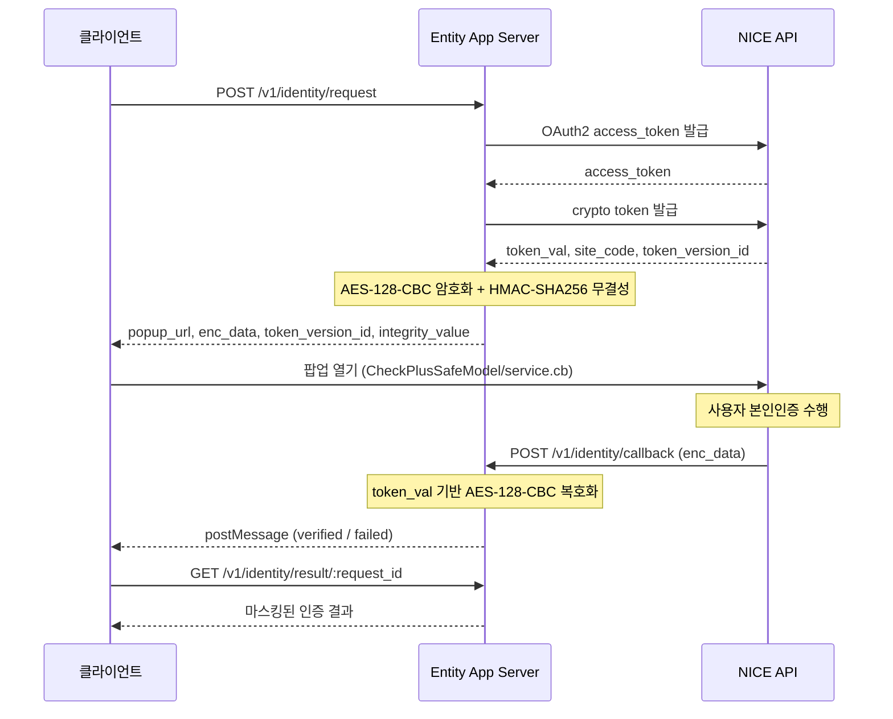

# 본인인증(Identity Verification) 가이드

NICE, KMC, 다날 중계사를 통한 본인인증 가이드입니다.
이 문서는 플러그인의 개요/설정/운영 가이드를 중심으로 다룹니다.
실제 라우트표, 호출 예제, 응답 예제는 [Identity Routes](../routes/identity-routes.md) 문서를 참고하세요.

---

## 목차

- [개요](#개요)
- [프로바이더 비교](#프로바이더-비교)
- [인증 흐름](#인증-흐름)
- [설정](#설정)
- [파일 구조](#파일-구조)
- [보안 고려사항](#보안-고려사항)
- [운영 팁](#운영-팁)

---

## 개요

Entity App Server의 Identity 플러그인은 주민등록번호 기반 휴대폰 본인인증을 단일 API로 추상화합니다.

- NICE / KMC / 다날 중계사 지원 (플러그가능 어댑터 패턴)
- OAuth2 + AES/3DES 암호화, HMAC 무결성 검증
- CI(연계정보) 기반 중복 가입 확인
- 인증 결과 자동 마스킹 (이름, 생년월일, 전화번호)
- 요청별 TTL 관리 및 만 시각 자동 만료
- NICE PASS 앱 인증(`authtype: "P"`) 지원

---

## 프로바이더 비교

| provider | driver  | 암호화 방식               | 특징                                                |
| -------- | ------- | ------------------------- | --------------------------------------------------- |
| NICE     | `nice`  | AES-128-CBC + HMAC-SHA256 | OAuth2 v2 API, token_val 키 유도, PASS 앱 인증 지원 |
| KMC      | `kmc`   | 3DES-CBC                  | CP코드/URL코드 기반, 간단한 설정                    |
| 다날     | `danal` | AES-256-CBC               | client_id/secret 기반 키 유도                       |

---

## 인증 흐름

### NICE (기본 프로바이더)



### KMC / 다날

기본 흐름은 동일하나, 별도 OAuth 토큰 없이 직접 암호화→팝업→콜백→복호화 과정을 거칩니다.

---

## 설정

`configs/plugins/identity.json`:

```json
{
    "enabled": false,
    "default": "nice",
    "return_url": "/v1/identity/callback",
    "success_redirect_url": "",
    "failure_redirect_url": "",
    "duplicate_ci_check": true,
    "request_ttl_sec": 300,
    "result_ttl_sec": 600,
    "providers": {
        "nice": {
            "driver": "nice",
            "site_code": "${NICE_SITE_CODE}",
            "site_password": "${NICE_SITE_PASSWORD}",
            "client_id": "${NICE_CLIENT_ID}",
            "client_secret": "${NICE_CLIENT_SECRET}",
            "product_id": "2101979031",
            "api_url": "https://nice.checkplus.co.kr",
            "token_url": "https://svc.niceapi.co.kr:22001/digital/niceid/oauth/oauth/token",
            "crypto_url": "https://svc.niceapi.co.kr:22001/digital/niceid/v1.0/common/crypto/token"
        },
        "kmc": {
            "driver": "kmc",
            "site_code": "${KMC_SITE_CODE}",
            "site_password": "${KMC_SITE_PASSWORD}",
            "api_url": "https://www.kmcert.com"
        },
        "danal": {
            "driver": "danal",
            "cp_cd": "${DANAL_CP_CD}",
            "url_cd": "${DANAL_URL_CD}",
            "cert_key": "${DANAL_CERT_KEY}",
            "api_url": "https://cert.danal.co.kr"
        }
    },
    "rate_limit": {
        "per_ip_per_hour": 10,
        "per_account_per_day": 5
    }
}
```

### 설정 항목

| 키                     | 타입    | 기본값 | 설명                                       |
| ---------------------- | ------- | ------ | ------------------------------------------ |
| `enabled`              | boolean | false  | 플러그인 활성화 여부                       |
| `default`              | string  | —      | 기본 프로바이더 (`nice` / `kmc` / `danal`) |
| `return_url`           | string  | —      | 중계사 콜백 수신 URL                       |
| `success_redirect_url` | string  | `""`   | 인증 성공 시 리다이렉트 URL (팝업 내)      |
| `failure_redirect_url` | string  | `""`   | 인증 실패 시 리다이렉트 URL (팝업 내)      |
| `duplicate_ci_check`   | boolean | true   | CI 해시 기반 중복 가입 확인 활성화         |
| `request_ttl_sec`      | number  | 300    | 인증 요청 유효 시간 (초)                   |
| `result_ttl_sec`       | number  | 600    | 인증 결과 조회 가능 시간 (초)              |
| `rate_limit`           | object  | —      | 요청 제한 설정                             |

### NICE 프로바이더 설정

| 키              | 설명                                                       |
| --------------- | ---------------------------------------------------------- |
| `client_id`     | NICE API OAuth2 client ID                                  |
| `client_secret` | NICE API OAuth2 client secret                              |
| `product_id`    | NICE 상품코드 (NICE에서 발급)                              |
| `site_code`     | (선택) 기본 사이트코드 — 실제로는 crypto API 응답에서 사용 |
| `api_url`       | NICE 팝업 베이스 URL                                       |
| `token_url`     | OAuth2 토큰 발급 URL                                       |
| `crypto_url`    | 크립토 토큰 발급 URL                                       |

### KMC 프로바이더 설정

| 키         | 설명                         |
| ---------- | ---------------------------- |
| `cp_cd`    | KMC CP 코드                  |
| `url_cd`   | KMC URL 코드                 |
| `cert_key` | KMC 인증서 키 (3DES 키 유도) |
| `api_url`  | KMC 팝업 베이스 URL          |

### 다날 프로바이더 설정

| 키              | 설명                             |
| --------------- | -------------------------------- |
| `client_id`     | 다날 CP ID (AES IV 유도)         |
| `client_secret` | 다날 client secret (AES 키 유도) |
| `api_url`       | 다날 팝업 베이스 URL             |

---

## 파일 구조

```
src/app/plugins/identity/
  index.ts          — Fastify 플러그인 등록
  config.ts         — configs/plugins/identity.json 로더 + 환경변수 치환
  types.ts          — 타입 정의 (상태, 목적, 입출력, 설정)
  client.ts         — IdentityClient 인터페이스 정의
  client-nice.ts    — NICE CheckPlus v2 어댑터
  client-kmc.ts     — KMC 한국모바일인증 어댑터
  client-danal.ts   — 다날 본인인증 어댑터
  crypto.ts         — 프로바이더별 키 유도 + @system/crypto/cipher.ts re-export
  service.ts        — 비즈니스 로직 (요청 생성, 콜백 처리, CI 중복검사, 마스킹)
  entity-adapter.ts — Entity Server DB 연동 (인증 요청 CRUD)
  routes.ts         — 라우트 테이블
  handlers.ts       — API 핸들러
```

---

## 보안 고려사항

### 암호화 키 유도

- **NICE**: `sha256(token_val)` → 앞 16B: AES key, 뒤 16B: IV
    - HMAC 키: `sha256(token_val + "HMAC")` (32B)
- **KMC**: `sha256(cert_key)` → 앞 24B: 3DES key, 뒤 8B: IV
- **다날**: AES key = `sha256(client_secret)`, IV = `sha256(client_id)[:16]`

### 민감 정보 처리

- CI(연계정보)는 SHA-256 해시로만 저장 (`ci_hash`)
- 클라이언트 응답 시 이름/생년월일/전화번호 자동 마스킹
- 원문 CI는 서버 메모리에서만 처리 후 폐기

### 요청 보호

- IP당 시간당 / 계정당 일일 요청 제한 (rate_limit)
- 요청 ID는 `crypto.randomBytes(32).toString("hex")` (64자 hex)
- TTL 만료 후 자동 `expired` 처리

### 환경변수

모든 민감 설정값은 `${ENV_VAR}` 패턴으로 환경변수에서 주입합니다.

---

## 운영 팁

1. **NICE PASS 인증**: `method: "pass"` 로 요청하면 `authtype: "P"` 가 자동 추가됩니다.
2. **콜백 URL**: `return_url`은 외부에서 접근 가능한 URL이어야 합니다.
3. **팝업 닫기**: 콜백 핸들러는 `window.opener.postMessage`로 결과를 전달한 후 자동으로 팝업을 닫습니다.
4. **CI 중복검사**: `duplicate_ci_check: true` 시 동일 CI로 가입된 계정이 있으면 `is_duplicate: true` 가 반환됩니다.
5. **토큰 캐시**: NICE의 `token_val`은 서비스 레이어에서 `tokenVersionId`를 키로 캐시하며, 콜백 복호화 후 자동 삭제됩니다 (일회용).
